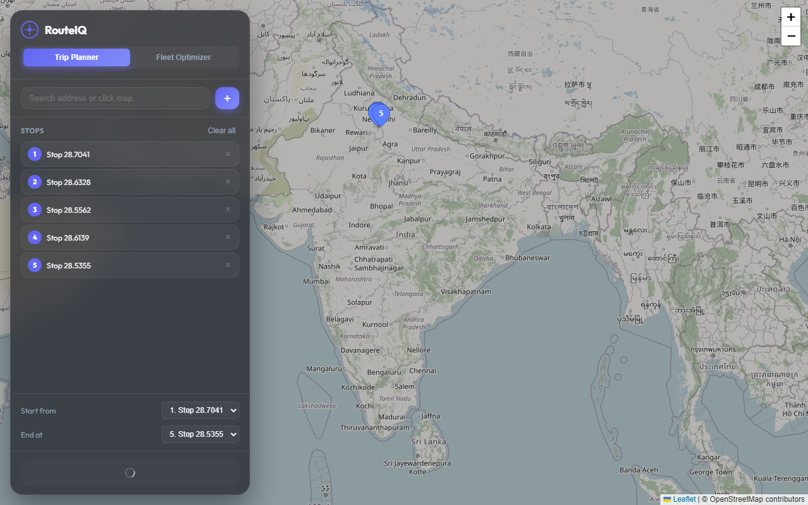
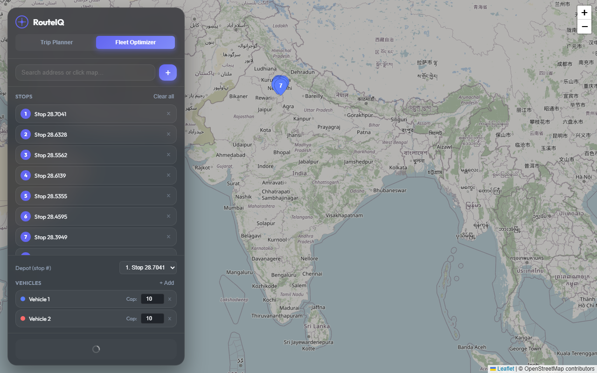
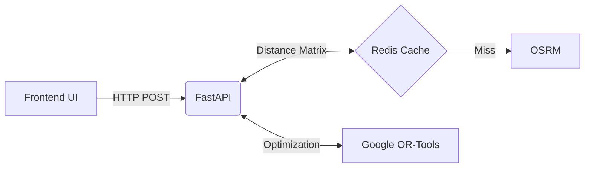

# RouteIQ v2

<p align="left">
  
  
  
  
  
</p>

**Production-grade route optimizer for trips and delivery fleets.**

Solves TSP (single vehicle) and VRP with time windows (multi-vehicle) in under 5 seconds for 20 stops using Google OR-Tools, real road travel times from OSRM, and Redis matrix caching.

<div align="center">
  
  
</div>

```bash
pip install -r requirements.txt
uvicorn main:app --reload --port 5000
```

---

## What this solves

- **Real road travel times** via OSRM (no straight-line approximations).
- **Multi-vehicle VRP** with capacity constraints and per-stop time windows ("arrive 10am–2pm").
- **Lightning fast** via Redis caching on the distance matrix (same stops = instant).
- **Dockerized**, self-hostable, and zero API costs.

---

## Architecture 

The application is built with a fast and modern stack, separating the routing logic from the mapping interface.



- **Backend**: FastAPI handles asynchronous requests and coordinates solving.
- **Solver**: Google OR-Tools executes Guided Local Search for TSP/VRP optimization.
- **Routing**: OSRM (Open Source Routing Machine) provides road network distances and polylines.
- **Cache**: Redis caches OSRM distance matrices to speed up repeated queries.
- **Frontend**: Vanilla JS and Leaflet.js provide an interactive trip and fleet planning UI.

---

## Project Structure

- `main.py`: FastAPI application and route handlers.
- `utils/`: Core logic including `solver.py` (TSP), `vrp_solver.py` (VRP), `osrm.py` (routing), and `cache.py` (Redis).
- `models.py`: Pydantic request/response schemas.
- `templates/` & `static/`: Single-page frontend app, styles, and Leaflet map integration.
- `benchmarks/` & `tests/`: Performance testing and unit/integration tests.
- `docker-compose.yml`: Full stack containerization (App + Redis + OSRM).

---

## API Reference

The API provides core routing endpoints. For detailed schemas, run the app and visit the interactive Swagger UI at **`http://localhost:5000/docs`**.

- `POST /optimize`: Single-vehicle TSP. Finds the shortest route visiting all stops.
- `POST /optimize/fleet`: Multi-vehicle VRP. Splits stops across vehicles respecting capacity and time windows.
- `POST /geocode`: Forward geocoding via Nominatim.
- `POST /reverse-geocode`: Coordinates to address mapping.
- `GET /health`: API liveness check.

---

## Getting Started

### Local Development

1. Copy `.env.example` to `.env`.
2. Install dependencies: `pip install -r requirements.txt`.
3. Run the server: `uvicorn main:app --reload --port 5000`.

### Docker Setup

The entire stack can be launched via Docker Compose, which includes the app, Redis, and an OSRM backend. 

```bash
docker-compose up -d
```
*(Note: OSRM requires initial map data preparation. Refer to the internal guides for provisioning the `osrm-data` volume with your regional `.osm.pbf` file.)*

---

## Testing & Benchmarks

Run the test suite with `pytest`:
```bash
pytest tests/ -v
```

Run algorithm benchmarks (Nearest Neighbor vs OR-Tools):
```bash
python benchmarks/compare_algorithms.py
```
